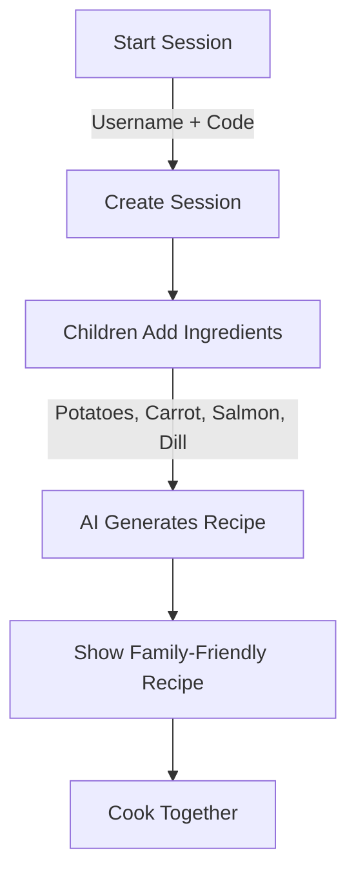
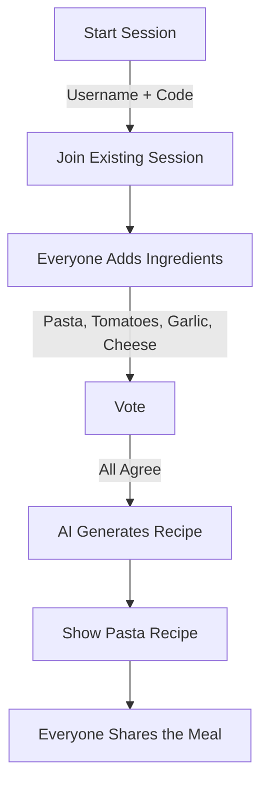
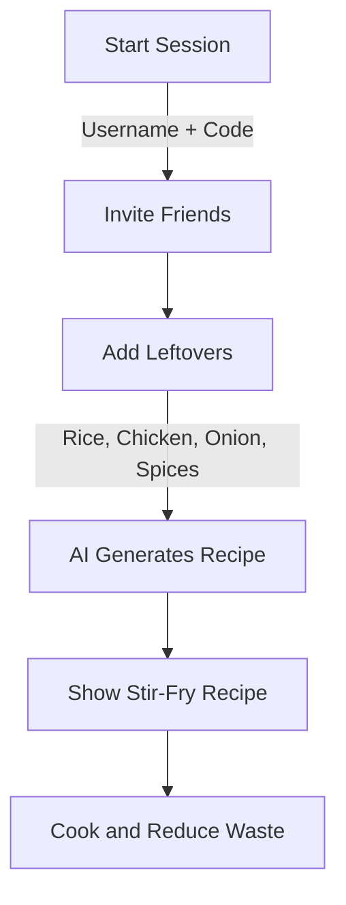

# PikNik Launch: Collaborative Cooking Reinvented

**PikNik** transforms cooking into a real-time collaborative event. Families, friends, and food lovers can combine creativity and technology to make every cooking session an interactive experience.

[GitHub Repository](https://github.com/lukketsvane/piknik)

---

## Overview

PikNik is a platform for collaborative meal creation using real-time interactions and AI-driven recipe generation. It ensures every session is interactive, using available ingredients effectively.

---

## Key Features

- **Real-Time Sessions**: Collaborate with up to six participants to add ingredients and generate recipes.
- **AI-Assisted Recipes**: PikNik’s AI provides recipe suggestions based on the ingredients you have.
- **Sustainability**: Reduce food waste by using all available ingredients.
- **Ingredient Management**: Add, edit, or remove ingredients.
- **Session Control**: Manage processes including voting and countdowns.

---

## User Interface

- **Login**: Join or create a session using a 4-digit code.
- **Main Screen**: Manage ingredients.
- **Recipe Generation**: Generate and share AI-created recipes.

[PikNik Web App](https://matmix.vercel.app/)

---

## User Story Flowcharts

### 1. Family Cooking Together

### 2. Friends in a Shared House

### 3. Reducing Food Waste

---

## Technical Overview

| Feature                          | Technology                | Description                          |
| -------------------------------- | ------------------------ | ------------------------------------ |
| **Frontend**                     | React, Next.js           | Responsive user interface.           |
| **Backend**                      | Node.js, Express         | Handles user requests and AI integration. |
| **Real-Time Communication**      | WebSockets (socket.io)   | Multi-user interaction.              |
| **AI Recipe Generation**         | Anthropic API            | Generates recipes.                   |
| **Database**                     | MongoDB or PostgreSQL    | Stores session data and ingredients. |
| **Authentication**               | JSON Web Tokens (JWT)    | User authentication.                 |
| **Responsive Design**            | CSS, Tailwind CSS        | Cross-device functionality.          |

---

## Data Model

| Data Model     | Attribute                | Description                             |
| -------------- | ------------------------ | --------------------------------------- |
| **Session**    | Session Code             | Unique identifier.                      |
|                | Participants             | List of participants.                   |
|                | Ingredients              | List of ingredients.                    |
| **Ingredient** | Name                     | Ingredient name.                        |
|                | Quantity                 | Quantity, e.g., 500 grams.              |
|                | Unit                     | Unit, e.g., grams, pieces.              |
|                | Category                 | Ingredient category.                    |
| **Recipe**     | Title                    | Recipe title.                           |
|                | Ingredient List          | Ingredients used.                       |
|                | Method                   | Preparation instructions.               |

---

## Future Development

- **Food Delivery Integration**: Order ingredients from within the app.
- **Save Recipes**: Option to save recipes.
- **Filtering**: Filter by category or dietary preference.

---

## Technical Considerations

- **Framework**: **React** with **Next.js** for the frontend, **Node.js** and **Express** for the backend.
- **Libraries**: **D3.js** for diagrams, **GSAP** for animations, **React Spring** for transitions.
- **Responsive Design**: Ensure usability on all devices.
- **Deployment**: Host live or package for offline use.

---

For more information and contributions, visit our [GitHub Repository](https://github.com/lukketsvane/piknik).

