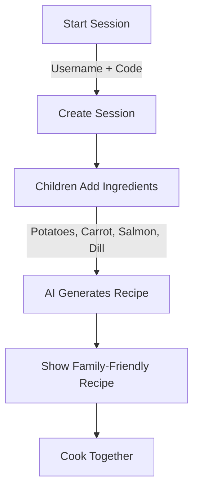
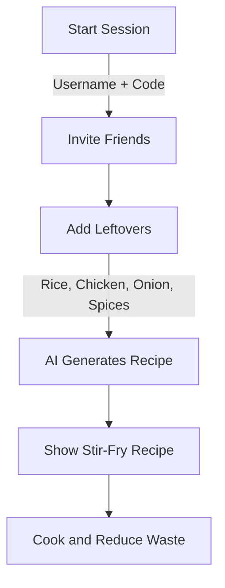

# PikNik Launch: Collaborative Cooking Reinvented

**PikNik** transforms cooking into a real-time collaborative event. Families, friends, and food lovers can combine creativity and technology to make every cooking session an interactive experience.

[GitHub Repository](https://github.com/lukketsvane/piknik)

---

## Overview

PikNik is a platform for collaborative meal creation using real-time interactions and AI-driven recipe generation. It ensures every session is interactive, using available ingredients effectively.

---

## User Story Flowcharts

### 1. Family Cooking Together

### 2. Reducing Food Waste

